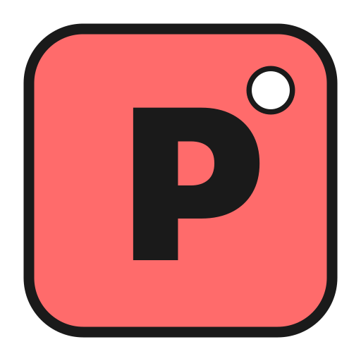

# pilotstack Desktop

<p align="center">
  
</p>

<p align="center">
  <strong>Open-source desktop application for <a href="https://pilotstack.app">pilotstack</a> - The Strava for Work</strong>
</p>

<p align="center">
  <a href="https://github.com/pilotstack-app/pilotstack-desktop/releases">
    
  </a>
  <a href="LICENSE">
    
  </a>
  <a href="https://github.com/pilotstack-app/pilotstack-desktop/actions/workflows/ci.yml">
    
  </a>
</p>

---

Record your creative process and generate verified timelapse videos to prove your work. pilotstack Desktop captures your screen in the background, tracks activity, and compresses hours of work into engaging 30-second highlights.

## ✨ Features

- 🎬 **Ghost Recording** - Record in the background without interruption to your workflow
- ⚡ **Smart Timelapse** - Automatically compress hours of work into 30-second highlights
- ✅ **Verified Badge** - Anti-cheat detection proves authentic work with verification scores
- 📊 **Activity Tracking** - Keyboard, mouse, scroll, and idle detection for accurate metrics
- ☁️ **Cloud Sync** - Upload and share your recordings via [pilotstack.app](https://pilotstack.app)
- 🎵 **Background Music** - Add music to your timelapse videos
- 🖥️ **Cross-Platform** - Available for macOS, Windows, and Linux

## 📥 Download

Download the latest release for your platform from the [Releases page](https://github.com/pilotstack-app/pilotstack-desktop/releases).

| Platform | Download |
|----------|----------|
| macOS (Apple Silicon) | `pilotstack-*-mac-arm64.dmg` |
| macOS (Intel) | `pilotstack-*-mac-x64.dmg` |
| Windows | `pilotstack-*-win-x64.exe` |
| Linux (AppImage) | `pilotstack-*-x64.AppImage` |
| Linux (Debian) | `pilotstack-*-x64.deb` |

### Verify Your Download

All releases include SHA256 checksums and SBOM (Software Bill of Materials). Verify your download:

```bash
# macOS/Linux - Check against checksums.txt
sha256sum -c checksums.txt

# Or manually verify a specific file
sha256sum pilotstack-*-mac-arm64.dmg
```

Review the `sbom.spdx.json` file included with each release for the complete list of dependencies.

## 🛠️ Building from Source

### Prerequisites

- [Node.js](https://nodejs.org/) 20+
- [pnpm](https://pnpm.io/) 9+
- Python 3.11 (for native modules)

### Quick Start

```bash
# Clone the repository
git clone https://github.com/pilotstack-app/pilotstack-desktop.git
cd pilotstack-desktop

# Install dependencies
pnpm install

# Build workspace packages
pnpm run build:packages

# Start development mode
pnpm run dev
```

### Build Commands

```bash
# Build for your current platform
pnpm run build

# Platform-specific builds
pnpm run build:mac     # macOS (DMG + ZIP)
pnpm run build:win     # Windows (NSIS installer + ZIP)
pnpm run build:linux   # Linux (AppImage + DEB)

# Build all platforms (requires appropriate environment)
pnpm run build:all
```

### Development

```bash
# Start development server (React + Electron hot-reload)
pnpm run dev

# Type checking
pnpm run type-check

# Linting
pnpm run lint
```

Build outputs are placed in the `release/` directory.

## 🔒 Security

This application is **open-source** so you can audit the code that runs on your machine. We believe in transparency, especially for an app that captures your screen.

### Key Security Features

- **No Embedded Secrets** - All authentication uses OAuth PKCE flow; no API keys or secrets in the codebase
- **Sandboxed Renderer** - The React UI cannot access system resources directly; all operations go through validated IPC channels
- **Encrypted Storage** - Tokens and credentials are stored using:
  - macOS: Keychain via Electron's safeStorage
  - Windows: DPAPI via Electron's safeStorage
  - Linux: Secret Service API or encrypted fallback
- **Signed Requests** - All API calls use HMAC-SHA256 signatures for integrity
- **Context Isolation** - Full Electron security: `contextIsolation: true`, `nodeIntegration: false`, `sandbox: true`

### Security Audit

See [SECURITY_AUDIT.md](SECURITY_AUDIT.md) for the detailed security assessment confirming no secrets in the codebase.

### Reporting Security Issues

**Please do not open public issues for security vulnerabilities.**

Report security concerns privately to: **security@pilotstack.app**

We will respond within 48 hours and work with you to address the issue.

## 🏗️ Architecture

```
pilotstack-desktop/
├── electron/           # Main process (Node.js)
│   ├── config/         # Configuration management
│   ├── core/           # Core application logic
│   ├── ipc/            # IPC handlers with Zod validation
│   ├── managers/       # Capture, recordings, video managers
│   ├── monitors/       # Activity and idle monitoring
│   ├── services/       # Auth, upload, window services
│   ├── utils/          # FFmpeg, crypto, watermark utilities
│   ├── workers/        # Background processing workers
│   ├── main.ts         # Entry point
│   └── preload.ts      # Context bridge
├── src/                # Renderer process (React)
│   ├── components/     # UI components
│   ├── views/          # Application views
│   ├── App.tsx         # Main React component
│   └── main.tsx        # React entry point
├── packages/           # Workspace packages
│   ├── types/          # @pilotstack/types - Shared TypeScript types
│   └── verification/   # @pilotstack/verification - Score algorithms
└── build/              # Electron-builder configuration
```

For detailed architecture documentation, see [ARCHITECTURE.md](ARCHITECTURE.md).

## 🤝 Contributing

We welcome contributions! Please read our [Contributing Guidelines](CONTRIBUTING.md) before submitting a pull request.

### Quick Contribution Guide

1. Fork the repository
2. Create a feature branch: `git checkout -b feature/amazing-feature`
3. Make your changes
4. Run checks: `pnpm run type-check && pnpm run lint`
5. Commit with a descriptive message
6. Push and open a Pull Request

## 📋 Requirements

### Minimum System Requirements

- **macOS**: 10.15 (Catalina) or later
- **Windows**: Windows 10 or later (64-bit)
- **Linux**: Ubuntu 18.04+, Fedora 30+, or equivalent

### Permissions Required

- **Screen Recording** - Required for capturing your workflow
- **Accessibility** (macOS) - Required for keyboard/mouse activity detection
- **Network** - Required for cloud sync features

## 🔗 Links

- [pilotstack.app](https://pilotstack.app) - Web dashboard and cloud platform
- [Documentation](https://docs.pilotstack.app) - Full documentation
- [Releases](https://github.com/pilotstack-app/pilotstack-desktop/releases) - Download latest version
- [Issues](https://github.com/pilotstack-app/pilotstack-desktop/issues) - Report bugs or request features

## 📄 License

This project is licensed under the MIT License - see the [LICENSE](LICENSE) file for details.

---

<p align="center">
  Made with ❤️ by the <a href="https://pilotstack.app">pilotstack</a> team
</p>
